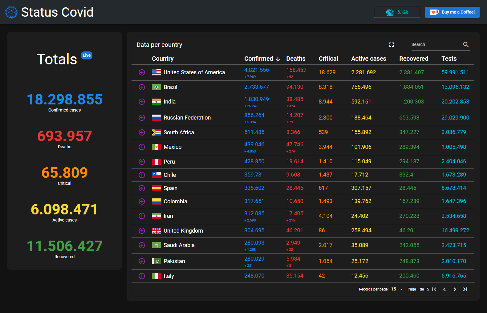
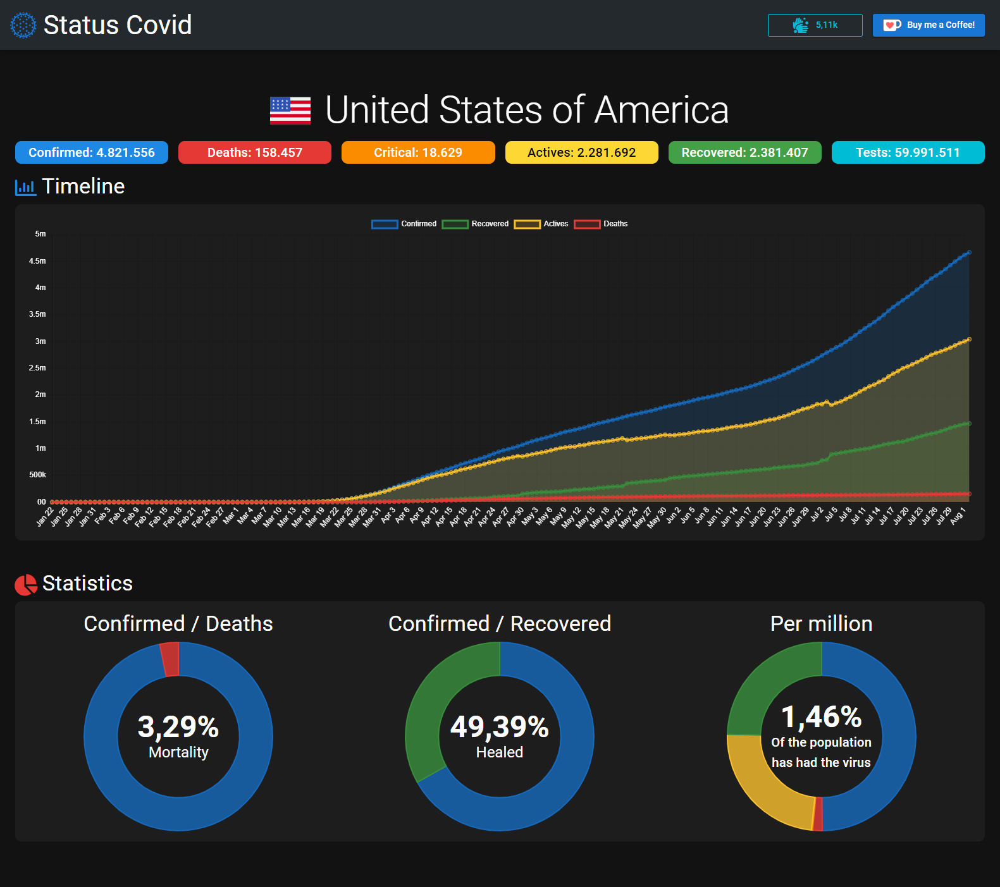

# covid-tracker (covid-tracker-front)

A simple Covid tracker using Vue2, quasar, Vuex and i18mn

<p align="center" >
  
</p>

<p align="center" >
  
</p>


## Install the dependencies
```bash
yarn
```

### Start the app in development mode (hot-code reloading, error reporting, etc.)
```bash
quasar dev
quasar dev -m cordova -T android
quasar dev -m capacitor -T android
```

Open emulator
```bash
D:\Android-sdk\emulator\emulator.exe  -avd Pixel_3a_API_28 -netdelay none -netspeed full
```

### Lint the files
```bash
yarn run lint
```

### Build the app for production
```bash
quasar build
quasar build -m android
quasar build -m capacitor -T android
```

### Customize the configuration
See [Configuring quasar.conf.js](https://quasar.dev/quasar-cli/quasar-conf-js).


### Extract i18n keys

```bash
yarn vue-i18n-extract report -a -v "./src/**/*.?(js|vue)" -l "./src/i18n/*.?(js|json|yml|yaml)"
yarn vue-i18n-extract report -a -v "D:/proyectos/covid-tracker-front/src/**/*.?(js|vue)" -l "D:/proyectos/covid-tracker-front/src/i18n/*.?(js|json|yml|yaml)"
```

# Sign cordova android apk

### Generates Key 
pass: 119k30p.
```bash
keytool -genkey -v -keystore my-release-key.keystore -alias alias_name -keyalg RSA -keysize 2048 -validity 20000
```
###  Signs apk with key
```bash
jarsigner -verbose -sigalg SHA1withRSA -digestalg SHA1 -keystore my-release-key.keystore <path-to-unsigned-apk-file> alias_name
```
###  Generates signed apk
```bash
zipalign -v 4 <path-to-same-apk-file> HelloWorld.apk
```

## Cordova issues
If gradle fails open with ide and build gradle


## Capacitor issues
If there is the following issue when running
```
Manifest merger failed : Attribute application@appComponentFactory value=(android.support.v4.app.CoreComponentFactory) from [com.android.support:support-compat:28.0.0] AndroidManifest.xml:22:18-91
	is also present at [androidx.core:core:1.2.0] AndroidManifest.xml:24:18-86 value=(androidx.core.app.CoreComponentFactory).
	Suggestion: add 'tools:replace="android:appComponentFactory"' to <application> element at AndroidManifest.xml:5:5-44:19 to override.
```

Add this to "src-capacitor\android\gradle.properties"
```
android.useAndroidX=true
android.enableJetifier=true
```

If the app crash on startup change this in "src-capacitor\android\app\src\main\AndroidManifest.xml"
```
android:name="android.support.v4.content.FileProvider"
```
to
```
android:name="androidx.core.content.FileProvider"
```


### Notes

```
const [pass, fail] = a.reduce(([p, f], e) => (e.country !== 'World' ? [[...p, e], f] : [p, [...f, e]]), [[], []]);
```
